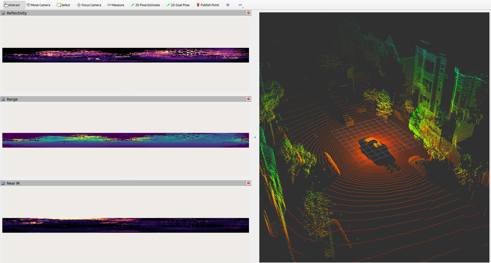

# lidarscan-msg-yolo-demo


## Project Description

**lidarscan-msg-yolo-demo** is a demonstration project written in python that consumes lidar_msgs::LidarInfo and lidar_msgs::LidarScan messages and runs YOLO object detection directly on structured LidarScan in ROS. It also depends on the package lidar-conversions and invokes the method LidarScanToPointCloud which could take a
lidar_msgs::LidarInfo and lidar_msgs::LidarScan and converts them into a PointCloud2 message. The results are visualizing using RVIZ.

## Screenshot

Below is a screenshot of the RViz visualization used in this demo:



## Usage

```bash
ros2 launch lidarscan_msg_yolo_demo lidarscan_view.launch.py
```